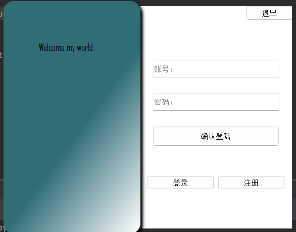
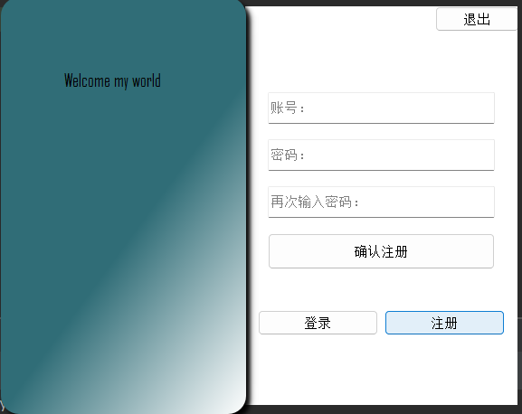
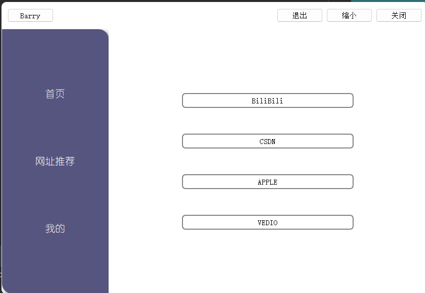
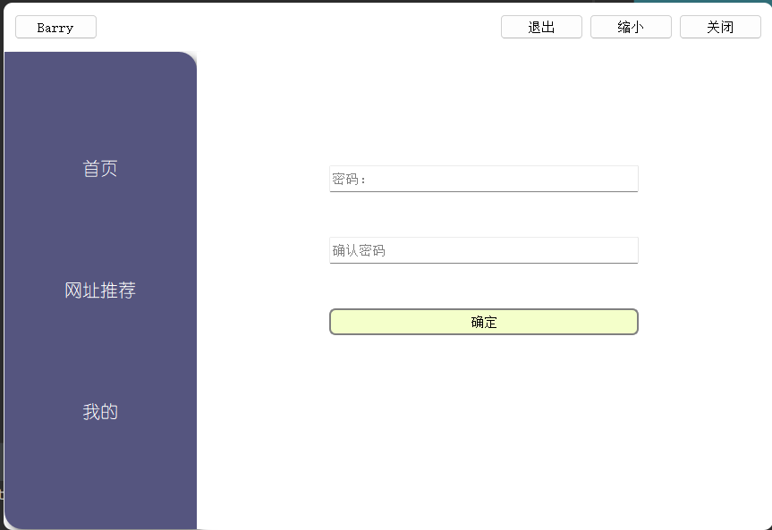

# PyQt_webview
------------------
## 1.花了一天学习了PyQt5的使用，写了一个简单的webview小程序

## 2.工具
- python3.9
- PyQt5
- Qt Designer
- postgreSQL
相关库见requirements.txt

## 3.教程
- [PyQt5教程](https://www.bilibili.com/video/BV1bL411B7ht/)