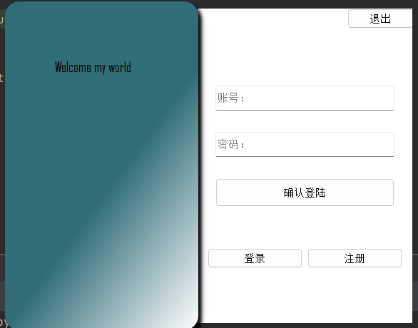
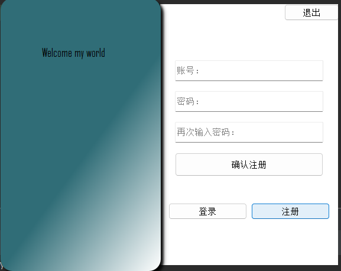
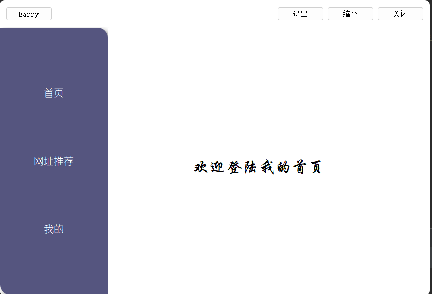
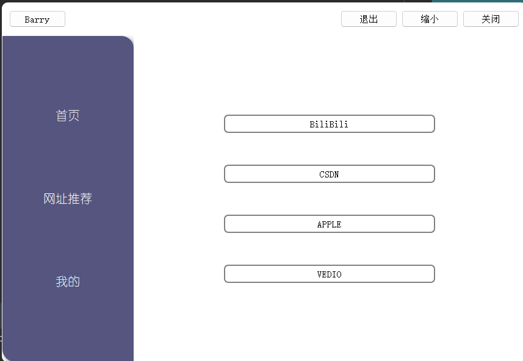
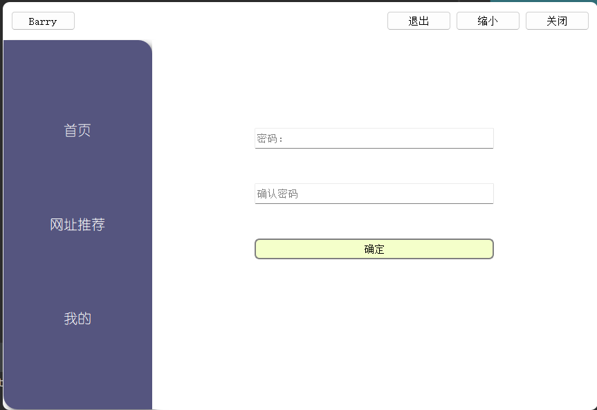

# PyQt_webview
------------------
## 1.花了一天学习了PyQt5的使用，写了一个简单的webview小程序

## 2.工具
- python3.9
- PyQt5
- Qt Designer
- postgreSQL

相关库见requirements.txt

## 3.打包成独立运行exe
- 1.安装pyinstaller
- 2.在cmd中进入到你的程序目录
- 3.输入:pyinstaller --onefile --noconsole --icon=your_icon.ico your_program.py
- 4.在dist目录下找到你的程序exe文件，双击运行即可

#### 注：your_icon.ico是你的图标文件，your_program.py是你的程序文件

#### 本例中：pyinstaller --onefile --noconsole --icon=E:/temporary\QT/pyqt0524/readme_img/R.ico main.py

## 4.教程
- [PyQt5教程](https://www.bilibili.com/video/BV1bL411B7ht/)